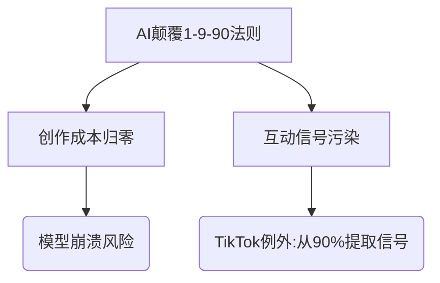

# 📑 [When Social Media = AI](https://medium.com/@NirZicherman/when-social-media-ai-875733f8d391)

**核心论点提炼**  
- **1–9–90法则颠覆**：AI时代创作成本低于消费，传统金字塔（1%创作→9%互动→90%消费）被反转  
- **关键数据**：超50%网络文本已由AI生成/翻译（arXiv研究佐证）  
- **反常识结论**：社交内容病毒传播的真正危机在于「9%互动信号造假」（机器人操控算法）  

**记忆点语句**  
> \\"创作可以被提示，消费需要精神能量\\"  
> \\"这是《黑镜》式未来：生成内容针对眼球和点击优化\\"  

**分层思维导图**  

**灵感触发区**  
- 教育领域如何应对「AI代写作业」导致的共同学习缺失？  
- 区块链能否验证内容的人类创作比例？  
- 如果90%用户转向AR隐形眼镜消费内容，1-9-90法则会如何演变？  

**标签体系**  
#AI社会学/注意力经济 #趋势分析 #平台治理 #警示性预测 #待观察现象

---
 

## 📝 我的笔记

> [!note]- 个人思考
> - 这篇文章的关键启发：
> - 可以应用到的领域：
> - 待深入探索的问题：
